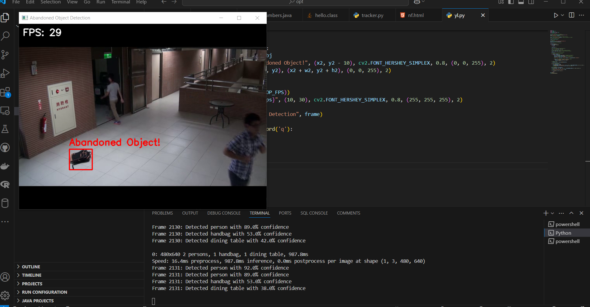

# Abandoned Object Detection

## Overview
This project implements an **Abandoned Object Detection** system using computer vision techniques. The system tracks objects in a video stream and detects unattended luggage, bags, or other suspicious items in public areas using **YOLOv8** and **Background Subtraction**.

## Features
- **Real-time Object Detection**: Uses **YOLOv8** to identify luggage-related objects.
- **Object Tracking**: Assigns unique IDs to detected objects and tracks their movement.
- **Background Subtraction**: Detects stationary objects using adaptive MOG2 background subtraction.
- **Abandonment Detection**: Triggers alerts if an object remains static for a set duration.
- **Customizable Parameters**: Adjust tracking sensitivity and detection thresholds.
- **Optimized for Performance**: Runs efficiently on both CPU and GPU.

## Technologies Used
- **Programming Language**: Python
- **Libraries & Frameworks**: OpenCV, NumPy, TensorFlow/PyTorch, Ultralytics YOLO
- **Model**: YOLOv8 (Pre-trained on COCO dataset)
- **Tracking Algorithm**: Custom centroid tracking algorithm

## Installation
### Prerequisites
Ensure you have Python installed, then install the required dependencies:
```sh
pip install opencv-python numpy torch torchvision ultralytics
```

### Clone Repository
```sh
git clone https://github.com/your-repo/abandoned-object-detection.git
cd abandoned-object-detection
```

## Usage
1. **Run YOLO-based Object Detection**
   ```sh
   python detect_abandoned_objects.py
   ```
2. **Run Background Subtraction-based Detection**
   ```sh
   python background_subtraction.py
   ```
3. Modify parameters in `config.py` for different environments.

## Output
The system processes video streams and highlights abandoned objects. Detected objects are labeled in real-time, and alerts are triggered for static objects.



## Future Enhancements
- Improve multi-object tracking in crowded environments.
- Implement remote alerting through a cloud-based notification system.
- Enhance model accuracy using fine-tuned datasets.


## License
This project is licensed under the MIT License - see the [LICENSE](LICENSE) file for details.


